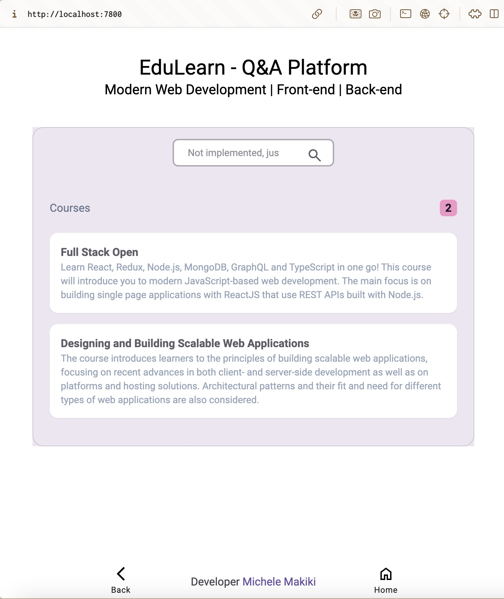
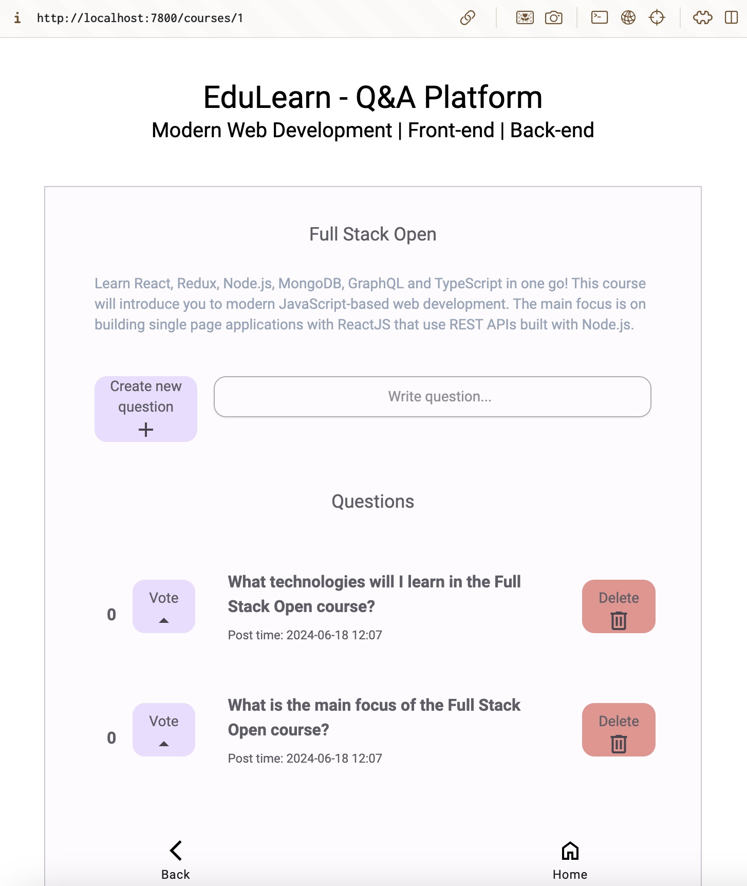
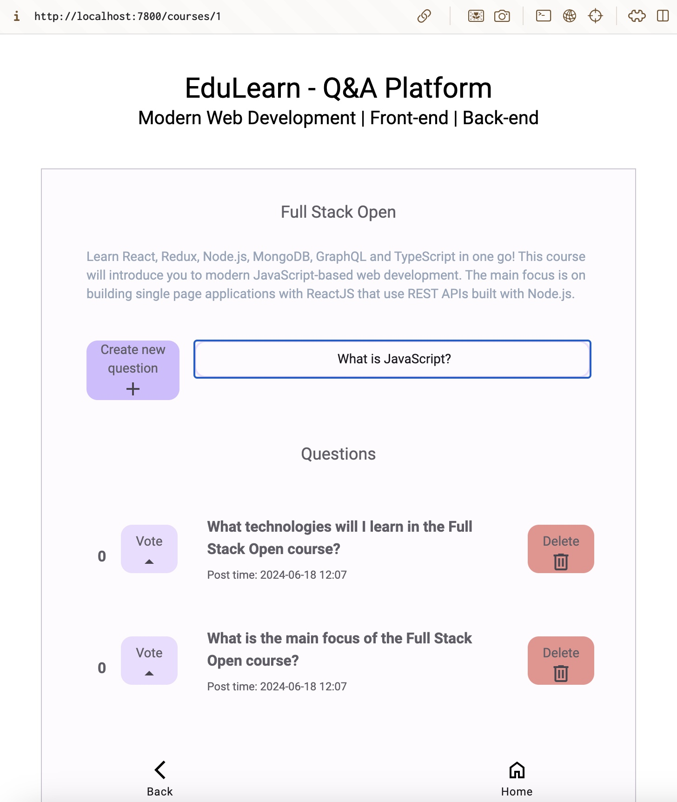
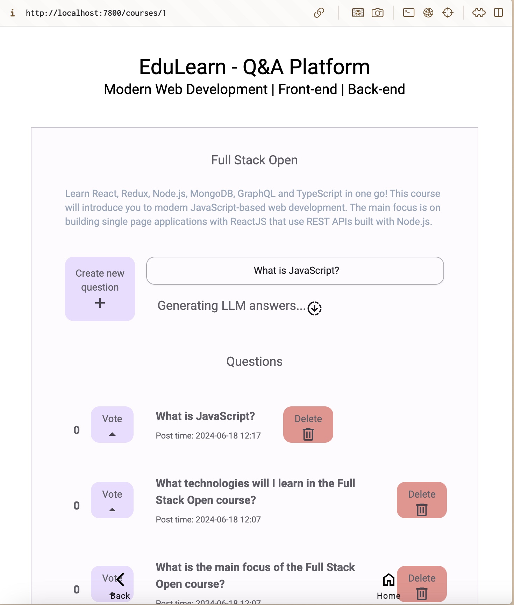
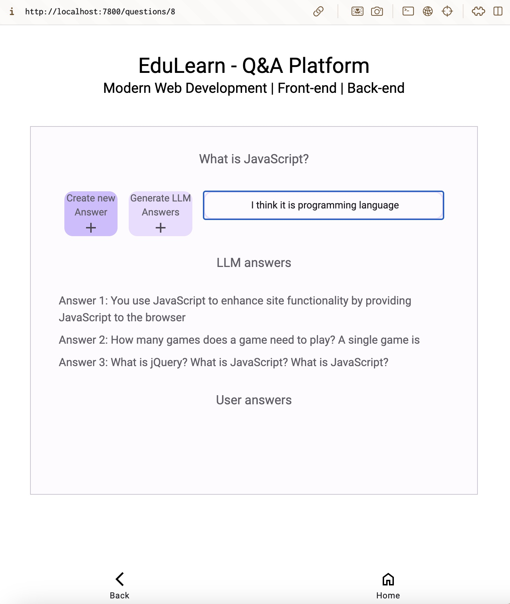
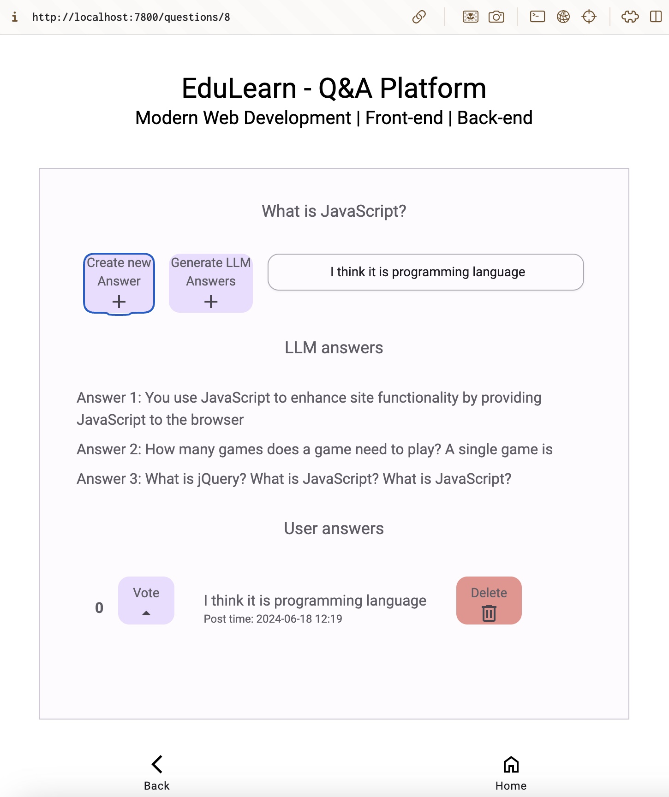

# EduLearn - Q&A Platform

## Description

This Web App named "EduLearn - Q&A Platform" is designed to facilitate knowledge sharing and collaboration among web development practioners. It allows users to post questions, provide answers, and engage in discussions on various topics. 

There are two premade courses (topics) to discuss about

1. Full Stack Open (Helsinki University)
2. Designing and Building Scalable Web Applications (Aalto University)

## Other info

* Architecture and improvements -> [Reflection.md](REFLECTION.md)
* Running app and testsing -> [Running.md](RUNNING.md)

## Example usage of app

### Main page

First, open the **Main page** that lists premade courses (topics). By clicking the "Full Stack Open" we get to the **Course Page**. 

### Course page

There are 2 premade questions that the user can click which leads to the **Question page**. Users can also vote questions and delete their questions but not other users.

In **Course page** we can create new question by writing it to input and clicking "Create new quesition +". This will also make API request to LLM endpoint which generates 3 answers to question.

Now we can see our question is listed at the top of old questions. UI also informs that "Generating LLM answers...". Lets wait for that and after move to the **question page** by clicking "What is JavaScript?"

### Question page

Here we can see the generated LLM answers as well as generate new ones. We also see other user-made answers and can create our own answers. Let's create "I think it is programming language" by typing it to input and after that clicking "Create new Answer +"

Yes! now we can see our answer in UI

## Other notes

### LLM endpoint

Provides an endpoint for a large language model (a small model with poor quality responses included), an API endpoint starter for the QA platform, and an UI starter for the QA platform.

Starting the application up for the first time may take a while, as it also downloads the (small) large language model (approx. 250 megabytes) and packages it into an image.
