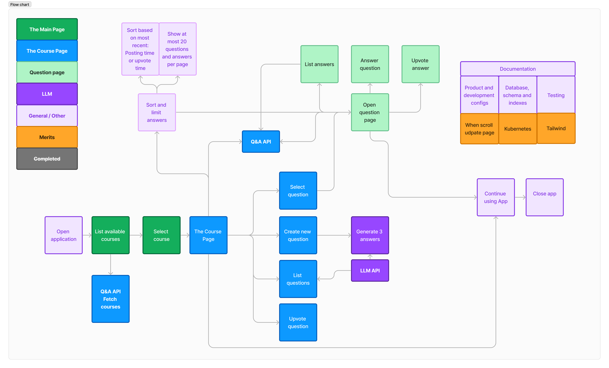

# Key design decisions

## Architecture

The web app follows a modular architecture, consisting of the following key components:

1. **User Interface (UI) - qa-ui:** The front-end of the application is built using the Astro + Svelte framework combination. It provides a responsive and intuitive user interface for seamless navigation and interaction. The design of the UI is made using Tailwind.
    
2. **Backend Server - qa-api:** The backend server is implemented using Deno and It handles requests from the UI, processes data, and interacts with the database.
    
3. **Database:** The web app utilizes a relational database management system (RDBMS)  PostgreSQL to store and manage user data, questions, answers, and other relevant information.

4. **API Endpoints:** The backend server exposes various RESTful API endpoints to handle operations such as user registration, posting questions - answers, - votes and retrieving data.
    
6. **Logic flow chart (below)** 

# Improvements ideas

## Functionalities
* Implement search functionality for courses
* Mechanism to create answers to other user answers. This would encourage to develop of deeper conversations

## User Interface
* Possibility to personalize the theme

## Performance
* Caching mechanism to reduce database load

## LLM
* Better quality LLM endpoint as the course default (Facebook/opt-125m) does not provide good answers to longer questions. 
