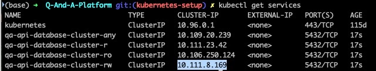
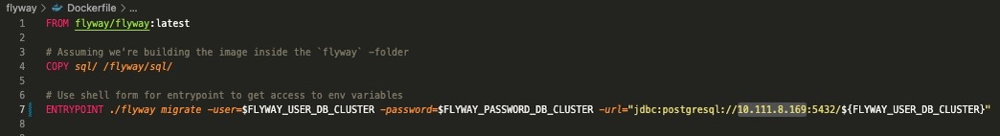
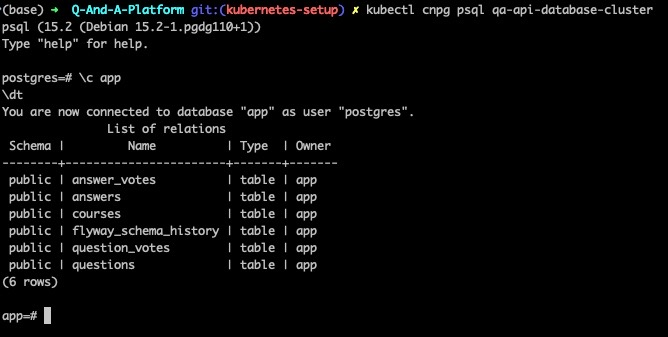
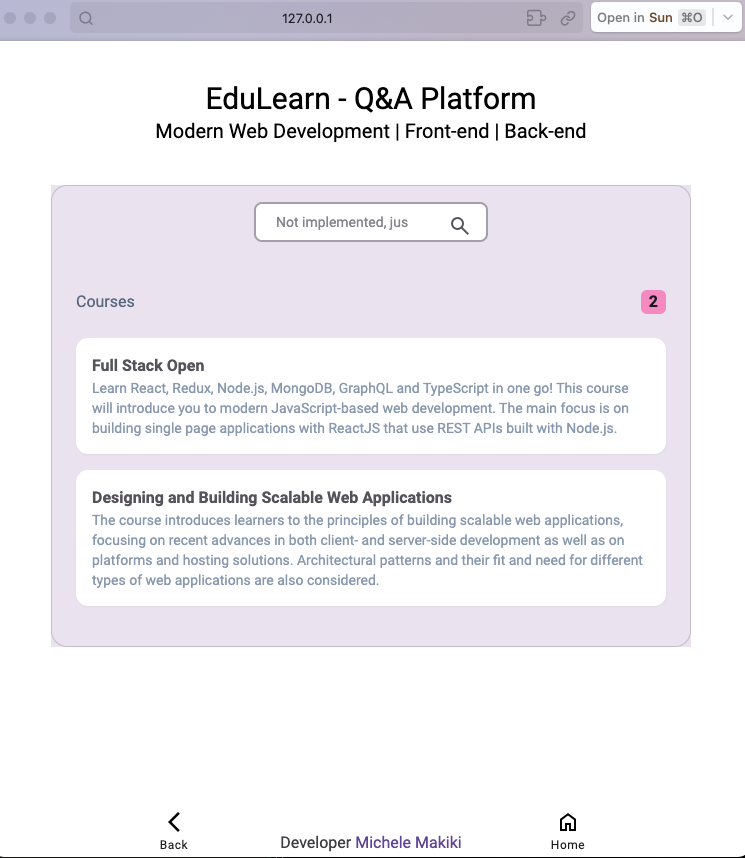

# Running and Testing - Q&A Platform 

## Pre configurations for MacBook M1 users

Change the first line of Dockerfiles **qa-api/Dockerfile** like below

```js
FROM denoland/deno:alpine-1.31.0
```
to
```js
FROM lukechannings/deno:v1.37.0
```

## Build images

```bash
cd llm-api
docker build -t llm-api .
cd ..
```
```bash
cd playwright
docker build -t e2e-playwright .
cd ..
```

## Running app with development configurations

```bash
docker compose up
```

## Running app with production configurations

### Pre steps
1. Create copy of project.env and rename it projectprod.env
2. Change FLYWAY_URL and PGHOST to following:
 
 ```env
 FLYWAY_URL=jdbc:postgresql://database-server-edulearn-prod/database
 PGHOST=database-server-edulearn-prod
 ```

then...

```bash
docker compose -f docker-compose.prod.yml up -d
```


## Testing - Playwright

### Running all tests

```bash
docker compose run --rm --entrypoint=npx playwright playwright test
```

### Running test files one by one

```bash
docker-compose run --rm --entrypoint=npx playwright playwright test mainpage.spec.js
docker-compose run --rm --entrypoint=npx playwright playwright test coursepage.spec.js
docker-compose run --rm --entrypoint=npx playwright playwright test questionpage.spec.js
```
## Testing - k6

### Pre steps
1. Install k6 from here -> https://k6.io/docs/get-started/installation/

## Running app with kubernetes configuration

### Notes

* Run all "apply" commands in project root directory and build images in qa-api, qa-ui and llm-api folders
* Creating images could take some time
* For monitoring pods and services:

```bash
kubectl get pods
```
```bash
kubectl get services
```

### Installation 

1. Download minikube from https://minikube.sigs.k8s.io/docs/start amnd follow instructions for getting started
2. Install kbectl from https://kubernetes.io/docs/tasks/tools/ 
3. Install CloudNatibePG operator

```bash
kubectl apply -f https://raw.githubusercontent.com/cloudnative-pg/cloudnative-pg/release-1.19/releases/cnpg-1.19.1.yaml
```

### Steps

### 1. Database cluster 

```bash
kubectl apply -f kubernetes/qa-api-database-cluster.yaml
```

Check CLUSTER-IP to and assign it to last row of flyway/Dockerfile. Example below

```bash
kubectl get services
```


</br>



### 2. Flyway migration

build image

```bash
cd flyway
minikube image build -t qa-api-database-migrations -f ./Dockerfile .
cd ..
```

check service host and  change last row of flyway/Dockerfile e.g.

```bash
ENTRYPOINT ./flyway migrate -user=$FLYWAY_USER_DB_CLUSTER -password=$FLYWAY_PASSWORD_DB_CLUSTER -url="jdbc:postgresql://<PUT HOST HERE>:5432/${FLYWAY_USER_DB_CLUSTER}"
```


```bash
kubectl apply -f kubernetes/qa-api-database-migration-job.yaml
```

### 3. Check status and connect to db to see tables exists

```shell
kubectl cnpg status qa-api-database-cluster
```
```shell
kubectl cnpg psql qa-api-database-cluster
```

```shell
\c app
\dt
```
Example 



exit
```shell
\q
```

### 4. Create images, services, deployments, autoscaling for qa-api, qa-ui & llm-api

#### qa-api

create image
```bash
cd qa-api
minikube image build -t qa-api -f ./Dockerfile.kube .
cd ..
```
create deployment and servces
```bash
kubectl apply -f kubernetes/qa-api-deployment.yaml
kubectl apply -f kubernetes/qa-api-service.yaml
kubectl apply -f kubernetes/qa-api-deployment-hpa.yaml
```

check that qa-api service up, run command and click http
```bash
minikube service qa-api-service --url
```

#### qa-ui

create image
```bash
cd qa-ui
minikube image build -t qa-ui -f ./Dockerfile .
cd ..
```
create deployment and servces
```bash
kubectl apply -f kubernetes/qa-ui-deployment.yaml
kubectl apply -f kubernetes/qa-ui-service.yaml
kubectl apply -f kubernetes/qa-ui-deployment-hpa.yaml
```

check that qa-api service up, run command and click http
```bash
minikube service qa-ui-service --url
```


#### llm-api

create image
```bash
cd llm-api
minikube image build -t llm-api -f ./Dockerfile .
cd ..
```
create deployment and servces
```bash
kubectl apply -f kubernetes/llm-api-deployment.yaml
kubectl apply -f kubernetes/llm-api-service.yaml
kubectl apply -f kubernetes/llm-api-deployment-hpa.yaml
```

check that qa-api service up, run command and click http
```bash
minikube service llm-api-service --url
```

#### 5. Create configmap, service, and deployment for nginx


create config map
```bash
kubectl apply -f kubernetes/nginx-configmap.yaml
```
create deployment and servces
```bash
kubectl apply -f kubernetes/nginx-deployment.yaml
kubectl apply -f kubernetes/nginx-service.yaml
```

check that service up that combines all components (UI, APIs, DB)
```bash
minikube service nginx --url
```

All finished, GJ🤝🏾



### Monitoring kubernetes with Grafana and Prome

#### Deploying the Prometheus Operator

Instruction from article: [How to monitor Kubernetes clusters with the Prometheus Operator](https://grafana.com/blog/2023/01/19/how-to-monitor-kubernetes-clusters-with-the-prometheus-operator/)

Run following to deploy Prometheus Operator CRD
```bash
kubectl apply -f https://raw.githubusercontent.com/prometheus-operator/prometheus-operator/main/bundle.yaml --force-conflicts=true --server-side=true
```


install role-based access control (RBAC) permissions to allow the Prometheus server to access the Kubernetes API to scrape targets and gain access to the Alertmanager cluster.
```bash
kubectl apply -f kubernetes/prometheus_rbac.yaml
```

Deploying Prometheus

Create a Prometheus instance
```bash
kubectl apply -f kubernetes/prometheus_instance.yaml
```

Forward local port to Prometheus servicce

```bash
 kubectl port-forward svc/prometheus-operated 9090:9090
 ```

Create a ServiceMonitor CRD

```bash
kubectl apply -f kubernetes/prometheus_service_monitor.yaml
```

Deploy grafana in kubernetes

```bash
kubectl create deployment grafana --image=docker.io/grafana/grafana:latest 
```

Create service for grafana 
```bash
kubectl expose deployment grafana --port 3000
```

Forward to the port 3000
```Bash
kubectl port-forward svc/grafana 3000:3000
```

NodePort for prometheus
```bash
kubectl apply -f kubernetes/expose_prometheus.yaml
````
Follow last chapter of the blog before conclusion for  "Creating a Grafana dashboard to monitor Kubernetes events"
